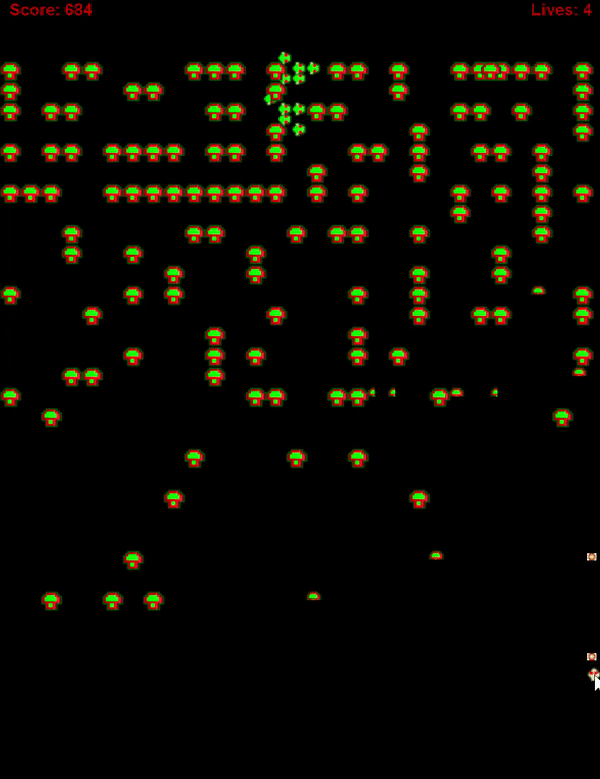

<h4 align="center"> A simple version of the classic game - Centipede by Atari Inc.</h4>
<p align="center">
In this game, the player fights off spiders and centipedes. 4 lives are give per game.
Centipede breaks into multiple centipedes on an attack while
decreasing the size by one with each hit.
</p>


<p align="center">
  <a href="#key-features">Key Features</a> •
  <a href="#how-to-use">How To Use</a> •
  <a href="#license">License</a>
</p>

</p>

## Key Features

* Centipede movement - Make changes, See changes
* Sound for attack
* Syntax highlighting
* Game speed control

## How To Use

Clone this repository and run `GamePlay.jave`

```bash
# Clone this repository
$ git clone https://github.com/daminiR/centipede_game.git

# Go into the repository
$ cd src

# Run the app
$ run `GamePlay.jave`
```

## License

MIT

---

> LinkedIn [@drijhwan](www.linkedin.com/in/drijhwan)
